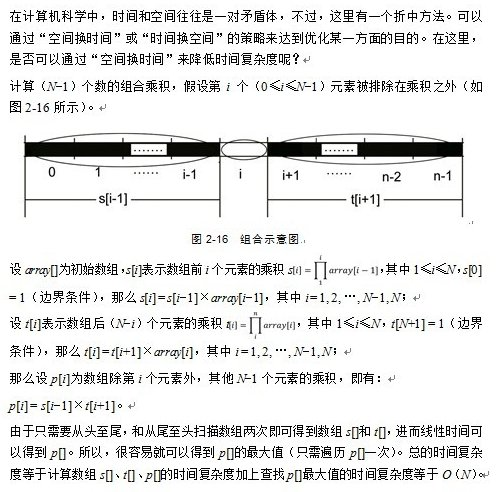
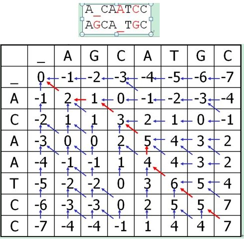
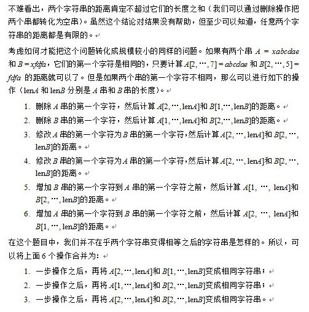

第二十八~二十九章：最大连续乘积子串、字符串编辑距离
===================================================

##前言
&emsp;&emsp;时间转瞬即逝，一转眼，又有4个多月没来更新blog了，过去4个月都在干啥呢？对的，今2013年元旦和朋友利用业余时间一起搭了个方便朋友们找工作的编程面试算法论坛：~~为学论坛<http://www.51weixue.com>~~ （因为后边的hero，论坛已逐步废弃）。最近则开始负责一款在线编程挑战平台：英雄会<http://hero.pongo.cn>，包括其产品运营，出题审题，写代码测试，制定比赛规则等等。  
&emsp;&emsp;前几天跟百度的几个朋友线下闲聊，听他们说，百度校招群内的不少朋友在找工作的时候都看过我的blog，一听当即便激起了自己重写此blog的欲望，恰巧眼下阳春三月(虽说已是3月，奇妙的是，前两天北京还下了一场大雪)，又是找工作的季节(相对于每年的9月份来说，3月则是一个小高潮)，那就从继续更新专为IT人员找工作时准备笔试面试的程序员编程艺术系列开始吧。  
&emsp;&emsp;再者从去年4月份上传的编程艺术前27章的PDF文档的1.3万下载量来看<http://download.csdn.net/detail/v_july_v/425633>9，此系列确确实实帮助了成千上万的人。Yeah，本文讲两个问题，  

* 第二十八章、最大连续乘积子串
* 第二十九章、字符串编辑距离

&emsp;&emsp;这两个问题皆是各大IT公司最喜欢出的笔试面试题，比如说前者是小米2013年校招笔试原题，而后者则更是反复出现，如去年9月26日百度一二面试题，10月9日腾讯面试题第1小题，10月13日百度2013校招北京站笔试题第二 大道题第3小题，及去年10月15日2013年Google校招笔试最后一道大题皆是考察的这个字符串编辑距离问题。  

&emsp;&emsp;OK，欢迎朋友们在本文下参与讨论，如果在线编译自己的代码（编程语言任选C/C++/Java/C#），可以上英雄会提交你的代码，有任何问题，欢迎随时不吝批评或指正，感谢。  

##第二十八章、最大连续乘积子串

**题目描述：**给一个浮点数序列，取最大乘积连续子串的值，例如 -2.5，4，0，3，0.5，8，-1，则取出的最大乘积连续子串为3，0.5，8。也就是说，上述数组中，3 0.5 8这3个数的乘积3*0.5*8=12是最大的，而且是连续的。

提醒：此最大乘积连续子串与最大乘积子序列不同，请勿混淆，前者子串要求连续，后者子序列不要求连续。也就是说：最长公共子串（Longest CommonSubstring）和最长公共子序列（LongestCommon Subsequence，LCS）的区别：  

* 子串（Substring）是串的一个连续的部分，

* 子序列（Subsequence）则是从不改变序列的顺序，而从序列中去掉任意的元素而获得的新序列；  

&emsp;&emsp;更简略地说，前者（子串）的字符的位置必须连续，后者（子序列LCS）则不必。比如字符串“ acdfg ”同“ akdfc ”的最长公共子串为“ df ”，而它们的最长公共子序列LCS是“ adf ”，LCS可以使用动态规划法解决。  

**解答：**  

&emsp;&emsp;**解法一、** 穷举，所有的计算组合：  

&emsp;&emsp;或许，读者初看此题，自然会想到最大乘积子序列问题类似于最大子数组和问题：<http://blog.csdn.net/v_JULY_v/article/details/6444021>，可能立马会想到用最简单粗暴的方式：两个for循环直接轮询。  

```c
double max=0;  
double start=0;  
double end=0;  
for (int i=0;i<num;i++) {  
    double x=arrs[i];  
    for (int j = i+1; j < num; j++) {  
        x*=arrs[j];  
        if(x>max){  
            max=x;  
            start=arrs[i];  
            end=arrs[j];  
        }  
    }  
}
```

**解法二、** 虽说类似于最大子数组和问题，但实际上具体处理起来诸多不同。为什么呢，因为乘积子序列中有正有负也还可能有0。我们可以把问题简化成这样：数组中找一个子序列，使得它的乘积最大；同时找一个子序列，使得它的乘积最小（负数的情况）。因为虽然我们只要一个最大积，但由于负数的存在，我们同时找这两个乘积做起来反而方便。也就是说，不但记录最大乘积，也要记录最小乘积。So，我们让  

* maxCurrent表示当前最大乘积的candidate，
* minCurrent反之，表示当前最小乘积的candidate，
* 而maxProduct则记录到目前为止所有最大乘积candidates的最大值。
&emsp;&emsp;（以上用candidate这个词是因为只是可能成为新一轮的最大/最小乘积）  

&emsp:&emsp;由于空集的乘积定义为1，在搜索数组前，maxCurrent，minCurrent，maxProduct都赋为1。
假设在任何时刻你已经有了maxCurrent和minCurrent这两个最大/最小乘积的candidates，新读入数组的元素x(i)后，新的最大乘积candidate只可能是maxCurrent或者minCurrent与x(i)的乘积中的较大者，如果x(i)<0导致maxCurrent<minCurrent，需要交换这两个candidates的值。  

&emsp;&emsp;当任何时候maxCurrent<1，由于1（空集）是比maxCurrent更好的candidate，所以更新maxCurrent为1，类似的可以更新minCurrent。任何时候maxCurrent如果比最好的maxProduct大，更新maxProduct。  

&emsp;&emsp;代码一：

```c
template <typename Comparable>    
Comparable maxprod( const vector<Comparable>&v)    
{    
    int i;    
    Comparable maxProduct = 1;    
    Comparable minProduct = 1;    
    Comparable maxCurrent = 1;    
    Comparable minCurrent = 1;    
    //Comparable t;    
    
    for( i=0; i< v.size() ;i++)    
    {    
        maxCurrent *= v[i];    
        minCurrent *= v[i];    
        if(maxCurrent > maxProduct)     
            maxProduct = maxCurrent;    
        if(minCurrent > maxProduct)    
            maxProduct = minCurrent;    
        if(maxCurrent < minProduct)    
            minProduct = maxCurrent;    
        if(minCurrent < minProduct)    
            minProduct = minCurrent;    
        if(minCurrent > maxCurrent)    
            swap(maxCurrent,minCurrent);    
        if(maxCurrent<1)    
            maxCurrent = 1;    
        //if(minCurrent>1)    
        //    minCurrent =1;    
    }    
    return maxProduct;     
}    
```
&emsp;&emsp;代码二：思路，记录以第i个结尾的最大乘积M和最小乘积m，并且记录这两个区间的起点（终点都是i），不断更新，来源<http://www.51weixue.com/thread-246-1-1.html>：  

```
pair<int,int> maxproduct(double *f,int n) { //返回最大乘积的起点终点  
int R = 0, r = 0;   //最大最小区间的 起点  
pair<int,int> ret = make_pair(0, 0);   //最大 最小的区间下标  
double M = f[0], m = f[0], answer = f[0];     // 最大 最小值  
    for (int i = 1; i < n; ++i) {  
        double t0 = f[i] * M, t1 = f[i] * m;  
        if (t0 > t1) {  
            M = t0;  
            m = t1;  
        }  
        else {  
            int t = R;  
            R = r;  
            r = t;  
            M = t1;  
            m = t0;  
        }  
        if (M < f[i]) {  
            M = f[i];  
            R = i;  
        }  
        if (m > f[i]) {  
            m = f[i];  
            r = i;  
        }  
        if (answer < M) {  
            answer = M;  
            ret = make_pair(R, i);  
        }  
    }  
    return ret;  
}  
```

**解法三、**  本题除了上述类似最大子数组和的解法，也可以直接用动态规划求解（其实，上述的解法一本质上也是动态规划，只是解题所表现出来的具体形式与接下来的解法二不同罢了。这个不同就在于下面的解法二会写出动态规划问题中经典常见的DP方程，而解法一是直接求解）。具体解法如下：  

&emsp;&emsp;假设数组为a[]，直接利用动归来求解，考虑到可能存在负数的情况，我们用Max来表示以a结尾的最大连续子串的乘积值，用Min表示以a结尾的最小的子串的乘积值，那么状态转移方程为：  

	Max=max{a, Max[i-1]*a, Min[i-1]*a};  
	Min=min{a, Max[i-1]*a, Min[i-1]*a};  

初始状态为Max[1]=Min[1]=a[1]。  

&emsp;&emsp;C/C++代码一，很简洁的一小段代码：  

```c
double func(double *a,const int n)  
{  
    double *maxA = new double[n];  
    double *minA = new double[n];  
    maxA[0] = minA[0] =a[0];  
    double value = maxA[0];  
    for(int i = 1 ; i < n ; ++i)  
    {  
        maxA[i] = max(max(a[i],maxA[i-1]*a[i]),minA[i-1]*a[i]);  
        minA[i] = min(min(a[i],maxA[i-1]*a[i]),minA[i-1]*a[i]);  
        value=max(value,maxA[i]);  
    }  
    return value;  
}  
```

&emsp;&emsp;C/C++代码二：

```c
/*  
 给定一个浮点数数组，有正有负数，0，正数组成,数组下标从1算起  
 求最大连续子序列乘积，并输出这个序列，如果最大子序列乘积为负数，那么就输出-1  
 用Max[i]表示以a[i]结尾乘积最大的连续子序列  
 用Min[i]表示以a[i]结尾乘积最小的连续子序列  因为有复数，所以保存这个是必须的  
*/    
void longest_multiple(double *a,int n){    
 double *Min=new double[n+1]();    
 double *Max=new double[n+1]();    
 double *p=new double[n+1]();    
 //初始化    
 for(int i=0;i<=n;i++){    
  p[i]=-1;    
 }    
 Min[1]=a[1];    
 Max[1]=a[1];    
 double max_val=Max[1];    
 for(int i=2;i<=n;i++){    
  Max[i]=max(Max[i-1]*a[i],Min[i-1]*a[i],a[i]);    
  Min[i]=min(Max[i-1]*a[i],Min[i-1]*a[i],a[i]);    
  if(max_val<Max[i])    
   max_val=Max[i];    
 }    
 if(max_val<0)    
  printf("%d",-1);    
 else    
  printf("%d",max_val);    
//内存释放    
 delete [] Max;    
 delete [] Min;    
}  
```

&emsp;&emsp;C#版完整代码(代码来自参加英雄会在线编程挑战之1019、最大乘积连续子串：<http://hero.pongo.cn/Question/Details?ID=19&ExamID=19>的在线提交代码的用户)：  

```
//答题英雄：danielqkj  
using System;  
public class Test   
{  
    void Max(double a, double b, double c)  
    {  
        double d = (a>b)?a:b;  
        return (d>c)?d:c;      
    }  
      
    void Min(double a, double b, double c)  
    {  
        double d = (a>b)?b:a;  
        return (d>c)?c:d;  
    }  
      
      
    public static void Main()  
    {  
        int n = Int32.parse(Console.readline());  
        double[] a = new double[n];  
        double maxvalue = a[0];  
        double[] max = new double[n];  
        double[] min = new double[n];  
        double start, end;  
          
        String[] s = Console.readline().split(' ');  
        for (int i = 0; i < n; i++)  
        {  
            a[i] = Double.parse(s[i])  
        }  
          
        max[0] = a[0];  
        min[0] = a[0];  
        start = 0, end = 0;  
          
        for (int i = 1; i < n; i++)  
        {  
            max[i]=Max(a[i], a[i]*max[i-1], a[i]*min[i-1]);  
            min[i]=Min(a[i], a[i]*max[i-1], a[i]*min[i-1]);  
              
            if (max[i] > maxvalue)  
            {  
                maxvalue = max[i];  
                end = i;  
            }  
        }  
          
        double mmm = maxvalue;  
        while ( (mmm - 0.0) > 0.00001 )  
        {  
            start = end;  
            mmm = mmm / a[start];  
        }  
          
        Console.Writeline(a[start] + " " + a[end] + " " + maxvalue);  
          
    }  
}  
```

**变种**  

&emsp;&emsp;此外，此题还有另外的一个变种形式，即给定一个长度为N的整数数组，只允许用乘法，不能用除法，计算任意（N-1）个数的组合中乘积最大的一组，并写出算法的时间复杂度。  

&emsp;&emsp;我们可以把所有可能的（N-1）个数的组合找出来，分别计算它们的乘积，并比较大小。由于总共有N个（N-1）个数的组合，总的时间复杂度为O（N2），显然这不是最好的解法。  

&emsp;OK，以下解答来自编程之美

&emsp;&emsp;**解法1**  



&emsp;&emsp;**解法2、**

&emsp;&emsp;此外，还可以通过分析，进一步减少解答问题的计算量。假设N个整数的乘积为P，针对P的正负性进行如下分析（其中，AN-1表示N-1个数的组合，PN-1表示N-1个数的组合的乘积）。  


1.P为0

&emsp;&emsp;那么，数组中至少包含有一个0。假设除去一个0之外，其他N-1个数的乘积为Q，根据Q的正负性进行讨论： 
 
	Q为0  
	说明数组中至少有两个0，那么N-1个数的乘积只能为0，返回0；  
	Q为正数  
	返回Q，因为如果以0替换此时AN-1中的任一个数，所得到的PN-1为0，必然小于Q；  
	Q为负数  
	如果以0替换此时AN-1中的任一个数，所得到的PN-1为0，大于Q，乘积最大值为0。  

2.P为负数  

&emsp;&emsp;根据“负负得正”的乘法性质，自然想到从N个整数中去掉一个负数，使得PN-1为一个正数。而要使这个正数最大，这个被去掉的负数的绝对值必须是数组中最小的。我们只需要扫描一遍数组，把绝对值最小的负数给去掉就可以了。  

3.P为正数

&emsp;&emsp;类似地，如果数组中存在正数值，那么应该去掉最小的正数值，否则去掉绝对值最大的负数值。  
&emsp;&emsp;上面的解法采用了直接求N个整数的乘积P，进而判断P的正负性的办法，但是直接求乘积在编译环境下往往会有溢出的危险（这也就是本题要求不使用除法的潜在用意），事实上可做一个小的转变，不需要直接求乘积，而是求出数组中正数（+）、负数（-）和0的个数，从而判断P的正负性，其余部分与以上面的解法相同。  

&emsp;&emsp;在时间复杂度方面，由于只需要遍历数组一次，在遍历数组的同时就可得到数组中正数（+）、负数（-）和0的个数，以及数组中绝对值最小的正数和负数，时间复杂度为O（N）。  

##第二十九章、字符串编辑距离

**题目描述:**给定一个源串和目标串，能够对源串进行如下操作：  
1.在给定位置上插入一个字符  
2.替换任意字符  
3.删除任意字符  

写一个程序，返回最小操作数，使得对源串进行这些操作后等于目标串，源串和目标串的长度都小于2000。  

**提醒：**上文前言中已经说过了，此题反复出现，最近考的最多的是百度和Google的笔试面试经常考察。下图则是2013年Google的校招试题原景重现：  


&emsp;&emsp;**解法一、**此题跟上面的最大连续乘积子串类似，常见的思路是动态规划，下面是简单的DP状态方程：

```
//动态规划：    
    
//f[i,j]表示s[0...i]与t[0...j]的最小编辑距离。    
f[i,j] = min { f[i-1,j]+1,  f[i,j-1]+1,  f[i-1,j-1]+(s[i]==t[j]?0:1) }    
    
//分别表示：添加1个，删除1个，替换1个（相同就不用替换）。  
```

&emsp;&emsp;**解法二、**本解法来自为学论坛：<http://www.51weixue.com/thread-482-1-1.html>。

&emsp;&emsp;编辑距离的定义和计算方法如下：  
Given two strings A and B, edit A to B with the minimum number of edit operations:  

* a) .Replace a letter with another letter
* b) .Insert a letter
* c) .Delete a letter

E.g.  
A = interestingly    _i__nterestingly  
B = bioinformatics   bioinformatics__  
                     1011011011001111  
Edit distance = 11  
    Instead of minimizing the number of edge operations, we can associate a cost function to the operations and minimize the total cost. Such cost is called edit distance. Instead of using string edit, in computational biology, people like to use string alignment.We use similarity function, instead of cost function, to evaluate the goodness of the alignment.  
    E.g. of similarity function: match – 2, mismatch, insert, delete – -1.  
Consider two strings ACAATCC and AGCATGC.  
One of their alignment is  


In the above alignment, space (‘\_’) is introduced to both strings. There are 5 matches, 1 mismatch, 1 insert, and 1 delete.The alignment has similarity score 7.  
&emsp;&emsp;A\_CAATCC   
&emsp;&emsp;AGCA\_TGC  
&emsp;Note that the above alignment has the maximum score.Such alignment is called optimal alignment.String alignment problem tries to find the alignment with the maximum similarity score!String alignment problem is also called global alignment problem.  
Needleman-Wunsch algorithm
&emsp;Consider two strings S[1..n] and T[1..m].Define V(i, j) be the score of the optimal alignment between S[1..i] and T[1..j].  
Basis:  
V(0, 0) = 0  
V(0, j) = V(0, j-1) + d(\_, T[j])：Insert j times  
V(i, 0) = V(i-1, 0) + d(S,\_)：Delete i times  
that is:  


Example :  



下面是代码，测试数据比较少，若有问题请指正：  

```c
//copyright@ peng_weida  
//实现代码如下：  
//头文件StrEditDistance.h  
#pragma once  
#include <string>  
class CStrEditDistance  
{  
public:  
    CStrEditDistance(std::string& vStrRow, std::string& vStrColumn);  
    ~CStrEditDistance(void);  
    int  getScore()    { return m_Score;   }  
    int  getEditDis()  { return m_EditDis; }  
    void setEditDis(int vDis) { m_EditDis = vDis; }  
    void setScore(int vScore) { m_Score = vScore; }  
private:  
    void process(const std::string& vStrRow, const std::string& vStrColumn);  
    int getMaxValue(int a, int b, int c)  
    {  
        if (a < b){ if (b < c) return c; return b; }  
        else { if (b > c) return a; return a < c ? c : a; }  
    }  
private:  
    int   m_EditDis;  
    int   m_Score;  
};  
//源文件StrEditDistance.cpp  
#include "StrEditDistance.h"  
#include <iostream>  
#include <iomanip>  
#define MATCH        2  
#define MISS_MATCH   -1  
#define INSERT       -1  
#define DELETE       -1  
CStrEditDistance::CStrEditDistance(std::string& vStrRow, std::string& vStrColumn)  
{  
    process(vStrRow, vStrColumn);  
}  
CStrEditDistance::~CStrEditDistance(void)  
{  
}  
//FUNCTION:  
void CStrEditDistance::process(const std::string& vStrRow, const std::string& vStrColumn)  
{  
    int editDis = 0;     //编辑距离  
    int row = vStrColumn.length();    
    int column = vStrRow.length();  
    const int sizeR = row + 1;  
    const int sizeC = column + 1;  
   
    int **pScore = new int*[sizeR];  //二维指针  
    for (int i = 0; i <= row; i++)  
    pScore = new int[sizeC];  
   
    //初始化第一行和第一列  
    for (int c = 0; c <= column; c++)  
        pScore[0][c] = 0 - c;  
    for (int r = 0; r <= row; r++)  
        pScore[r][0] = 0 - r;  
   
    //从v(1,1)开始每列计算  
    for (int c = 1; c <= column; c++)  
    {  
        for (int r = 1; r <= row; r++)  
        {  
          //计算v(i,j)  
          int valueMatch;  
          if (vStrColumn[r-1] == vStrRow[c-1])  
              valueMatch = MATCH;  
          else  
              valueMatch = MISS_MATCH;    
          int A = pScore[r-1][c] + INSERT;  
          int B = pScore[r][c-1] + DELETE;  
          int C = pScore[r-1][c-1] + valueMatch;  
          pScore[r][c] = getMaxValue(A, B, C);  
        }  
    }  
   
    //计算编辑距离  
    int r = row, c = column;  
    while(r > 0 && c > 0)  
    {  
        if (pScore[r][c]+1 == pScore[r-1][c])      { editDis++; r--; continue; }  
        else if (pScore[r][c]+1 == pScore[r][c-1]) { editDis++; c--; continue; }  
        else if (pScore[r][c]+1 == pScore[r-1][c-1]){ editDis++; r--; c--; continue; }  
        else { r--; c--; }  
    }  
    if (r > 0 && c == 0)  editDis += r;  
    else if (c > 0 && r == 0) editDis += c;  
   
    std::cout << std::endl;  
    //----------------DEBUG-------------------//  
    //打印数据  
    for (int i = 0; i <= row; i++)  
    {  
         for (int j = 0; j <= column; j++)  
         std::cout << std::setw(2) << pScore[j] << "  ";  
         std::cout << std::endl;  
    }  
    std::cout << std::endl;  
   
    //设置编辑距离和得分  
    setEditDis(editDis);  
    setScore(pScore[row][column]);  
   
    for (int i = 0; i <= row; i++)   //释放内存  
    {  
        delete pScore;  
        pScore = NULL;  
    }  
    delete[] pScore;  
}  
```

**类似**   
&emsp;&emsp;上述问题类似于编程之美上的下述一题「以下内容摘自编程之美第3.3节」：  

许多程序会大量使用字符串。对于不同的字符串，我们希望能够有办法判断其相似程度。我们定义了一套操作方法来把两个不相同的字符串变得相同，具体的操作方法为：  

1.修改一个字符（如把“a”替换为“b”）；  
2.增加一个字符（如把“abdd ”变为“aebdd ”）；  
3.删除一个字符（如把“travelling”变为“traveling”）。  

&emsp;&emsp;比如，对于“abcdefg”和“abcdef ”两个字符串来说，我们认为可以通过增加/减少一个“g”的方式来达到目的。上面的两种方案，都仅需要一次操作。把这个操作所需要的次数定义为两个字符串的距离，而相似度等于“距离+1”的倒数。也就是说，“abcdefg”和“abcdef”的距离为1，相似度为1 / 2 = 0.5。  
给定任意两个字符串，你是否能写出一个算法来计算出它们的相似度呢？  


&emsp;&emsp;这样，很快就可以完成一个递归程序，如下所示：

```c
Int CalculateStringDistance(string strA, int pABegin, int pAEnd,    
   string strB, int pBBegin, int pBEnd)     
{    
     if(pABegin > pAEnd)    
     {    
          if(pBBegin > pBEnd)    
               return 0;     
          else    
     
               return pBEnd – pBBegin + 1;    
     }    
    
     if(pBBegin > pBEnd)    
     {    
          if(pABegin > pAEnd)    
               return 0;    
          else    
               return pAEnd – pABegin + 1;    
     }    
    
     if(strA[pABegin] == strB[pBBegin])    
     {    
          return CalculateStringDistance(strA, pABegin + 1, pAEnd,    
            strB, pBBegin + 1, pBEnd);    
     }    
     else    
     {    
          int t1 = CalculateStringDistance(strA, pABegin, pAEnd, strB,     
            pBBegin + 1, pBEnd);    
          int t2 = CalculateStringDistance(strA, pABegin + 1, pAEnd,     
            strB,pBBegin, pBEnd);    
          int t3 = CalculateStringDistance(strA, pABegin + 1, pAEnd,    
            strB,pBBegin + 1, pBEnd);    
          return minValue(t1,t2,t3) + 1;    
     }    
}    
```

&emsp;&emsp;上面的递归程序，有什么地方需要改进呢？在递归的过程中，有些数据被重复计算了。比如，如果开始我们调用CalculateStringDistance(strA,1, 2, strB, 1, 2)，下图是部分展开的递归调用。  



&emsp;&emsp;可以看到，圈中的两个子问题被重复计算了。为了避免这种不必要的重复计算，可以把子问题计算后的解存储起来。如何修改递归程序呢？还是DP！请看此链接：<http://www.cnblogs.com/yujunyong/articles/2004724.html>。   

##深入
1.详细读者朋友们也已经看到了，百度/Google经常喜欢出这个字符串编辑距离，实际上，关于这个“编辑距离”问题在搜索引擎中有着重要的作用，如搜索引擎关键字查询中拼写错误的提示，如下图所示，当你输入“[Jult](https://www.google.com.hk/search?hl=zh-CN&newwindow=1&safe=strict&site=&source=hp&q=Jult&btnK=Google+%E6%90%9C%E7%B4%A2)”后，因为没有这个单词“Jult”，所以搜索引擎猜测你可能是输入错误，进而会提示你是不是找“July”：


但这个拼写错误检查的原理是什么呢？Google是基于贝叶斯统计推断的方法，相关原理详情可以看下Google的研发总监Peter Norvig写的这篇文章：<http://norvig.com/spell-correct.html>，以及fuanyif写的这篇：<http://www.ruanyifeng.com/blog/2012/10/spelling_corrector.html>。  

2.关于什么是“编辑距离”：一个快速、高效的Levenshtein算法实现，这个是计算两个字符串的算法，Levenshtein距离又称为“编辑距离”，是指两个字符串之间，由一个转换成另一个所需的最少编辑操作次数。当然，次数越小越相似。这里有一个BT树的数据结构，挺有意思的：<http://blog.notdot.net/2007/4/Damn-Cool-Algorithms-Part-1-BK-Trees>；  

3.最后，Lucene中也有这个算法的实现(我想，一般的搜索引擎一般都应该会有此项拼写错误检查功能的实现)，下面是lucene的源码(并没有太多优化，与实际工程中java注重实用性的原则并不背离)：  

```
public final class LevensteinDistance {  
   
    public LevensteinDistance () {  
    }  
      
// Compute Levenshtein distance:   
// see org.apache.commons.lang.StringUtils#getLevenshteinDistance(String, String)  
      
    public float getDistance (String target, String other) {  
      char[] sa;  
      int n;  
      int p[];   
//'previous' cost array, horizontally  
      int d[];   
// cost array, horizontally  
      int _d[];   
//placeholder to assist in swapping p and d  
   
        sa = target.toCharArray();  
        n = sa.length;  
        p = new int[n+1];   
        d = new int[n+1];   
         
        final int m = other.length();  
        if (n == 0 || m == 0) {  
          if (n == m) {  
            return 1;  
          }  
          else {  
            return 0;  
          }  
        }   
          
// indexes into strings s and t  
        int i;   
// iterates through s  
        int j;   
// iterates through t  
   
        char t_j;   
// jth character of t  
   
        int cost;   
// cost  
   
        for (i = 0; i<=n; i++) {  
            p[i] = i;  
        }  
   
        for (j = 1; j<=m; j++) {  
            t_j = other.charAt(j-1);  
            d[0] = j;  
   
            for (i=1; i<=n; i++) {  
                cost = sa[i-1]==t_j ? 0 : 1;  
                  
// minimum of cell to the left+1, to the top+1, diagonally left and up +cost  
                d[i] = Math.min(Math.min(d[i-1]+1, p[i]+1),  p[i-1]+cost);  
            }  
   
              
// copy current distance counts to 'previous row' distance counts  
            _d = p;  
            p = d;  
            d = _d;  
        }  
   
          
// our last action in the above loop was to switch d and p, so p now  
          
// actually has the most recent cost counts  
        return 1.0f - ((float) p[n] / Math.max(other.length(), sa.length));  
    }  
   
}  
```

##扩展
&emsp;&emsp;当然，面试官还可以继续问下去，如请问，如何设计一个比较两篇文章相似性的算法？这个问题的讨论可以看看这里：<http://t.cn/zl82CAH>。OK，字符串编辑距离这个问题实用性很强，限于篇幅，详情读者自己深入吧。  


##参考文献及推荐阅读

1.参与最大乘积连续子串问题的讨论：<http://www.51weixue.com/thread-246-1-1.html>，在线提交你的代码：<http://hero.pongo.cn/Question/Details?ID=19&ExamID=19>；  
2.参与字符串编辑距离问题的讨论：<http://www.51weixue.com/thread-482-1-1.html>，在线提交你的代码：<http://hero.pongo.cn/Question/Details?ID=20&ExamID=20>；  
3.杨氏矩阵查找、最大乘积连续子串、字符串循环右移、社区很忙等5题集中讨论地址：<http://bbs.csdn.net/topics/390398519>；  
4.编程之美； 
5.程序员第一~二十九章集锦：<http://blog.csdn.net/v_JULY_v/article/details/6460494>；  
6.<http://www.bjwilly.com/archives/395.html>；  

##后记
&emsp;&emsp;有种人喜欢远观代码，以欣赏代码的角度阅读代码，所谓如镜中美女只可远观不可亵玩焉，发现自己也陷入了这种境地。昨天买的一本《提高C++性能的编程技术》，书不错，推荐给大家。  
&emsp;&emsp;想看编程面试算法题的讲解，就进本blog；想参与笔试面试题的讨论，就上[为学论坛](http://www.51weixue.com/)；想在线刷笔试面试题，就上[英雄会](http://hero.csdn.net/)，祝各位好运，享受生活，享受工作，享受思考和编码的乐趣。  
&emsp;&emsp;July、二零一三年三月二十一日。
